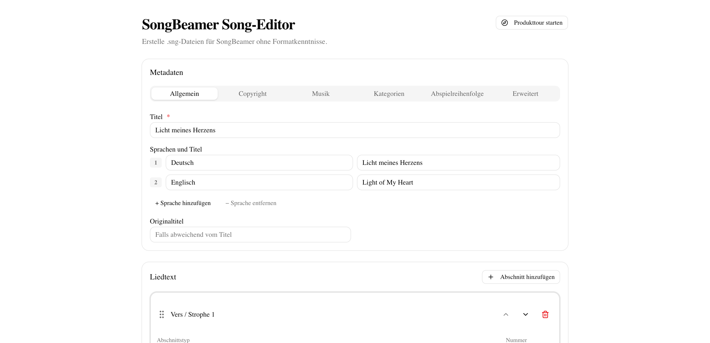
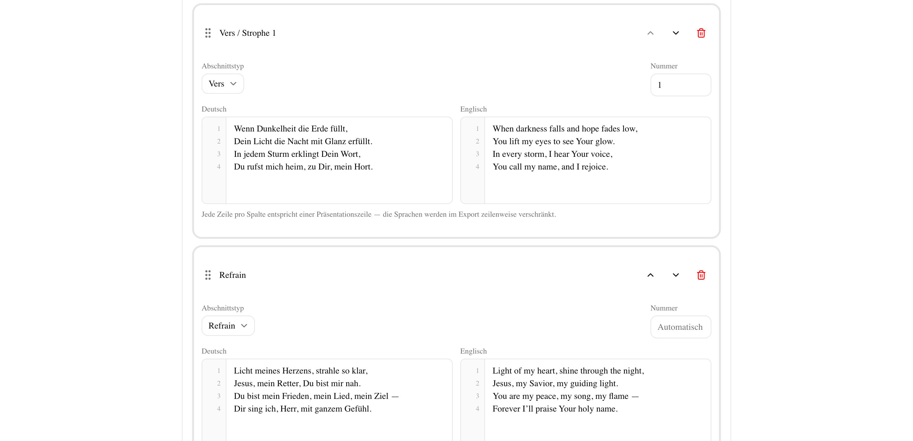
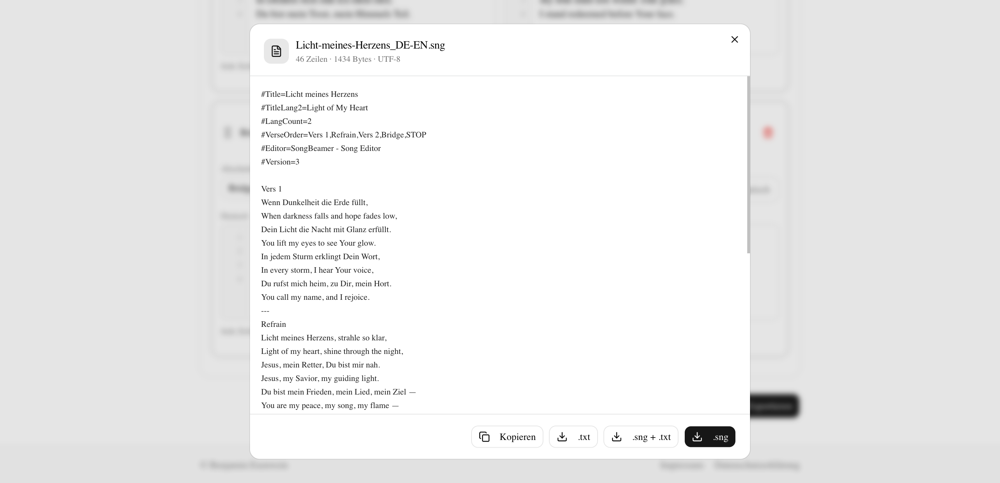

# SongBeamer Song-Editor

[](https://sonarcloud.io/summary/new_code?id=BennyGK15_sng-creator)

Ein browserbasierter Editor zum Erstellen von `.sng`-Dateien für SongBeamer. Die Anwendung richtet sich an Gemeinden, Worship-Teams und alle, die SongBeamer-kompatible Lieddateien ohne manuelle Formatkenntnisse pflegen oder exportieren möchten.

## Überblick

Mit dem SongBeamer Song-Editor lassen sich Liedmetadaten, Liedtexte und Abschnittsreihenfolgen komfortabel in einer Weboberfläche erfassen. Aus den Formulardaten wird direkt eine gültige `.sng`-Datei generiert, inklusive SongBeamer-Headern, Abschnittsmarkern und mehrsprachiger Zeilenstruktur.

Die Anwendung läuft vollständig im Browser. Es gibt kein Backend und keine serverseitige Speicherung von Liedinhalten.

## Screenshots

| Gesamtüberblick                                            | Abschnittseditor                                             |
| ---------------------------------------------------------- | ------------------------------------------------------------ |
|  |  |

| Folienvorschau                                           | Export-Dialog                                          |
| -------------------------------------------------------- | ------------------------------------------------------ |
|  |  |

## Features

- Erfassung von Song-Metadaten wie Titel, Originaltitel, Autor, Melodie, Verlag, CCLI, Tonart oder Tempo
- Unterstützung für 1 bis 3 Sprachen pro Lied
- Verwaltung von Liedabschnitten wie Vers, Refrain, Bridge, Intro oder Outro
- Automatische Nummerierung gleichartiger Abschnitte
- Drag-and-drop-Sortierung der Abschnitte
- Import bestehender `.sng`-Dateien zur Weiterbearbeitung und Erweiterung um weitere Sprachen
- Editor für die Abspielreihenfolge inklusive Wiederholungen und automatischem `STOP`
- Folienvorschau zur Kontrolle der späteren Darstellung
- Export als `.sng`, als `.txt` oder als beide Formate gleichzeitig, sowie Kopieren in die Zwischenablage
- Automatisch abgeleitete Dateinamen auf Basis von Titel und Sprachkürzeln
- Produkttour direkt in der Oberfläche

## Tech-Stack

- Next.js 16
- React 19
- TypeScript
- Tailwind CSS 4
- React Hook Form
- Zod
- dnd-kit
- @base-ui/react (via shadcn)

## Voraussetzungen

- Node.js 20 oder neuer
- pnpm

## Lokale Entwicklung

```bash
pnpm install
pnpm dev
```

Danach ist die Anwendung standardmäßig unter `http://localhost:3000` erreichbar.

## Rechtliche Angaben konfigurieren

Für Impressum und Datenschutzerklärung können die Inhalte über Umgebungsvariablen angepasst werden. Dazu kann die Datei `.env.example` als Vorlage für eine lokale `.env.local` verwendet werden.

Verfügbare Variablen:

- `LEGAL_ENTITY_TYPE` mit `general` oder `church`
- `LEGAL_OWNER_NAME`
- `LEGAL_ADDRESS_LINE_1`
- `LEGAL_ADDRESS_LINE_2`
- `LEGAL_EMAIL`
- `LEGAL_PHONE`
- `LEGAL_WEBSITE_URL`
- `LEGAL_WEBSITE_LABEL`
- `LEGAL_VAT_ID`
- `LEGAL_RESPONSIBLE_FOR_CONTENT`
- `LEGAL_REPRESENTED_BY`
- `LEGAL_CHURCH_BODY`
- `LEGAL_CHURCH_SUPERVISORY_AUTHORITY`
- `LEGAL_HOSTING_PROVIDER`
- `LEGAL_HOSTING_LOG_RETENTION_DAYS`
- `LEGAL_EFFECTIVE_DATE`

Standardmäßig ist der Betreiber-Typ neutral (`general`). Nur wenn `LEGAL_ENTITY_TYPE="church"` gesetzt ist, wird im Impressum ein zusätzlicher kirchenspezifischer Abschnitt angezeigt. So bleibt der Standardtext für nicht-kirchliche Betreiber unverändert.

## Verfügbare Skripte

```bash
pnpm dev           # Entwicklungsserver starten
pnpm build         # Produktionsbuild erzeugen
pnpm start         # Produktionsbuild lokal starten
pnpm lint          # ESLint ausführen
pnpm format        # Prettier auf relevante Dateien anwenden
pnpm format:check  # Formatierung prüfen
```

## Verwendung

1. Optional eine bestehende `.sng`-Datei importieren oder ein neues Lied anlegen.
2. Titel und optionale Metadaten prüfen oder ergänzen.
3. Eine oder mehrere Sprachen festlegen beziehungsweise zusätzliche Sprachen hinzufügen.
4. Liedabschnitte anlegen, anpassen oder bestehende Texte weiterbearbeiten.
5. Reihenfolge der Abschnitte im Tab Abspielreihenfolge prüfen oder anpassen.
6. Optional die Folienvorschau öffnen.
7. Die fertige Datei als `.sng`, `.txt` oder beide Formate gleichzeitig exportieren oder den Inhalt direkt in die Zwischenablage kopieren.

## Generiertes Ausgabeformat

Der Export orientiert sich am SongBeamer-Format:

- Header-Zeilen wie `#Title=`, `#Author=`, `#VerseOrder=` oder `#CCLI=`
- Abschnittsmarker wie `Vers 1`, `Refrain` oder `Bridge`
- Trennung von Abschnitten mit `---`
- Windows-Zeilenenden (`CRLF`), wie in SongBeamer üblich
- Bei mehrsprachigen Liedern werden die Zeilen sprachweise verschränkt ausgegeben

## Datenschutz und Datenverarbeitung

Die Anwendung verarbeitet Lieddaten ausschließlich im Browser des Nutzers. Es werden innerhalb dieses Projekts keine Inhalte an einen eigenen Server übertragen.

Hinweis: Beim Deploy auf eine öffentliche Plattform gelten zusätzlich deren Hosting-, Logging- und Datenschutzbedingungen.

## Deployment

Das Projekt ist eine reguläre Next.js-Anwendung und kann zum Beispiel auf Vercel oder einer eigenen Node.js-Umgebung betrieben werden.

Produktionsbuild lokal prüfen:

```bash
pnpm build
pnpm start
```

## Zielgruppe

Das Projekt ist besonders geeignet für:

- Gemeinden und Kirchen
- Lobpreis- und Musikteams
- Personen, die SongBeamer-Dateien pflegen, ohne das `.sng`-Format manuell zu schreiben

## Projektstatus

Das Repository enthält aktuell eine funktionsfähige Webanwendung für die Erstellung und den Export von SongBeamer-Dateien.
